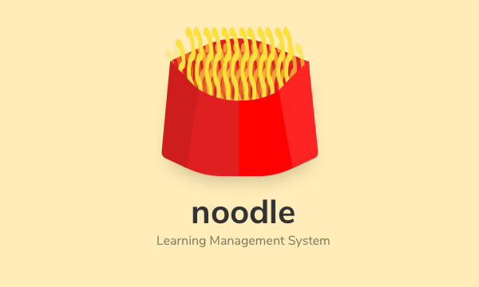

<div align="center">
	<br/>
	<br/>
    
	<br/>
	<br />
</div>


## Installation

Requires: MongoDB, NodeJS

```console
$ git clone https://github.com/samarsault/noodle
# Build the vue app
$ cd client && npm i && npm run build
$ cd ../server
# run the server
$ npm i && npm start
```

**Setting up**

To run the app, you will require a .env file for the server (`server/.env`) which contains some configuration details. The file will look something like(dont copy this):
```
GOOGLE_CLIENT_ID=sdjfoasjfoda
GOOGLE_CLIENT_SECRET=3232-u23.apps.googleusercontent.com
SECRET_KEY=adfnsa3qr080w4
CLIENT_URL=http://localhost:8080 (URL of the client build)
```
The GOOGLE_CLIENT_ID and GOOGLE_CLIENT_SECRET, used for authentication can be obtained via the [Google API console](https://console.developers.google.com/)

If you plan on working on any of the AWS related features, include the `aws_access_key_id`, `aws_secret_access_key`, `aws_region` and `aws_bucket_name` in the .env as well. These can be obtained from your [AWS account](https://docs.aws.amazon.com/general/latest/gr/aws-sec-cred-types.html)

The environment variables can be easily set by running `bash populate_env.sh` from the root folder.

Note that the first user you create is granted admin status by default.
